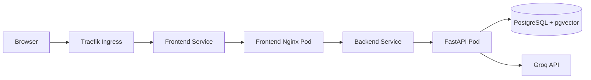

# RAG Experiment

[中文版 (Chinese Version)](README_zh.md)

A lightweight, explainable Retrieval-Augmented Generation (RAG) experiment built on **The Adventures of Sherlock Holmes**.

The project evaluates a complete RAG pipeline from document processing and vector retrieval to grounded answer generation. It includes an offline baseline experiment, an interactive dashboard, and a live question-answering API.

## What This Project Does

The source book is cleaned, split into 12 stories, and chunked into 909 sentence-aware text segments. Each chunk is embedded with `all-MiniLM-L6-v2` and stored in PostgreSQL with pgvector.

The project supports two workflows:

1. **Offline Baseline Evaluation**

   * Run eight fixed questions against exact cosine Top-10 retrieval.
   * Review retrieved chunks with an LLM-assisted, human-reviewed judgment process.
   * Calculate retrieval metrics such as Direct Hit@K, MRR, precision, sufficiency, and noise rate.
   * Generate grounded RAG answers from the same frozen Top-10 contexts.
   * Publish the complete experiment as `baseline_evaluation.json` for the dashboard.

2. **Live RAG Question Answering**

   * Accept an arbitrary user question from the web interface.
   * Generate a MiniLM query embedding.
   * Retrieve the Top 10 chunks from PostgreSQL using exact cosine distance.
   * Send only those chunks to Groq `openai/gpt-oss-120b`.
   * Return a grounded answer, evidence sufficiency status, confidence, timings, and validated chunk citations.

## Architecture

```mermaid
flowchart LR
    subgraph Offline[Offline Experiment Pipeline]
        A[Project Gutenberg Book] --> B[Clean and Split into 12 Stories]
        B --> C[Sentence-aware Chunking<br/>Target 180 / Max 220 Tokens]
        C --> D[909 Chunks]
        D --> E[MiniLM Embeddings<br/>384 Dimensions]
        E --> F[(PostgreSQL + pgvector)]

        Q[8 Baseline Questions] --> R[Exact Cosine Top 10]
        F --> R
        R --> J[LLM-assisted<br/>Human-reviewed Judgments]
        R --> G[GPT-OSS-120B<br/>Grounded Generation]
        J --> M[Retrieval Metrics]
        G --> P[Generated RAG Answers]
        M --> Z[baseline_evaluation.json]
        P --> Z
    end

    subgraph Live[Live RAG Pipeline]
        U[User Question] --> API[FastAPI Backend]
        API --> QE[MiniLM Query Embedding]
        QE --> VS[Exact Cosine Top 10]
        F --> VS
        VS --> PB[RAG Prompt Builder]
        PB --> LLM[Groq GPT-OSS-120B]
        LLM --> CV[Citation and Schema Validation]
        CV --> RESP[Grounded Answer + Citations]
    end

    subgraph UI[React Dashboard]
        DASH[Baseline Dashboard]
        ASK[Live Ask Page]
        DATA[Story and Chunk Explorer]
    end

    Z --> DASH
    UICALL[Browser /api/rag/answer] --> API
    ASK --> UICALL
    D --> DATA
```



## Main Components

### Backend

* Python 3.11
* FastAPI
* Sentence Transformers / `all-MiniLM-L6-v2`
* PostgreSQL 16 with pgvector
* Groq API with `openai/gpt-oss-120b`
* Strict structured-output and citation validation

The backend exposes:

```text
GET  /api/health/live
GET  /api/health/ready
POST /api/rag/answer
```

### Frontend

* React
* Vite
* TypeScript
* Tailwind CSS
* shadcn/ui
* Recharts

The dashboard provides:

* Aggregate baseline metrics
* Eight fixed baseline questions
* Reference Answer vs. Generated RAG Answer
* Top-10 retrieved chunks and judgment labels
* RAG citation highlighting
* Complete story and chunk exploration
* Live question answering

### Data and Evaluation

The generated evaluation bundle contains:

* 12 cleaned stories
* 909 chunks
* Eight fixed questions
* 80 evaluated retrieval results
* LLM-assisted judgments
* Retrieval metrics
* Generated RAG answers
* Source hashes and experiment metadata

The main dashboard data file is:

```text
experiments/baseline_v1/generated/baseline_evaluation.json
```

## Grounding Rules

The generation model is instructed to:

* Use only the retrieved Top-10 chunks.
* Ignore outside knowledge.
* Avoid guessing when evidence is missing.
* Report when the retrieved evidence is insufficient.
* Cite only chunk IDs included in the current retrieval result.

The backend validates all returned citations before exposing the answer to the frontend.

## Local Deployment

The complete V1 stack runs with Docker Compose:

```text
Browser
  -> Frontend Nginx
  -> FastAPI Backend
  -> PostgreSQL + pgvector
  -> Groq API
```

```bash
docker compose up --build
```

Typical local endpoints:

```text
Frontend: http://localhost:5173
Backend:  http://localhost:8000
```

## Container Publishing and K3s

GitHub Actions builds and publishes multi-architecture backend and frontend images to GHCR for:

```text
linux/amd64
linux/arm64
```

The same images can be used locally or deployed to a K3s homelab:



Traefik handles external routing and TLS. The frontend Nginx container serves the React application and proxies `/api` requests to the backend service.

## Project Status

V1 includes the complete baseline and live RAG loop:

```text
Document Processing
-> Embeddings
-> Vector Retrieval
-> Retrieval Evaluation
-> Grounded Generation
-> Dashboard
-> Live User Questions
```

Future work can compare the current dense retrieval baseline with query expansion, reranking, multi-query retrieval, or other retrieval-enhancement strategies.
