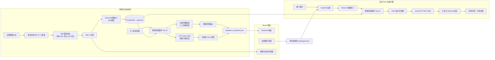
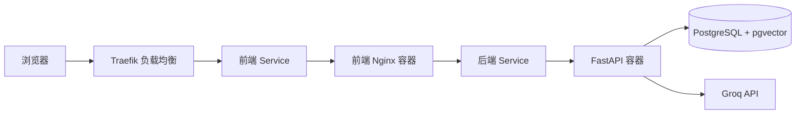

# RAG 实验项目 (RAG Experiment)

[English Version](README.md)

基于 **《福尔摩斯探案集》 (The Adventures of Sherlock Holmes)** 构建的轻量级、可解释的检索增强生成 (RAG) 实验项目。

本项目对完整的 RAG 流水线（从文档处理、向量检索到 grounded 答案生成）进行了评测。项目包含一个离线 Baseline 评估、一个交互式前端可视化看板以及一个实时的问答 API。

## 项目功能

对源书籍进行清洗，拆分为 12 个故事，并切分为 909 个句子感知型文本块 (Chunks)。每个文本块使用 `all-MiniLM-L6-v2` 模型生成对应的嵌入向量，并存储在带有 pgvector 扩展的 PostgreSQL 数据库中。

项目支持以下两种工作流：

1. **离线 Baseline 评估**
   * 针对 8 个固定的测试问题执行精确余弦距离 Top-10 检索。
   * 通过大模型辅助、人工最终审核的流程对检索到的 Chunks 进行了标注与判定 (Judgments)。
   * 自动计算检索相关的核心指标，包括：Direct Hit@K, MRR, Precision, Sufficiency (充分度) 以及 Noise Rate (噪声率)。
   * 基于完全相同的冻结 Top-10 上下文，利用生成模型产出有据可依的 RAG 回答。
   * 将全部实验数据发布为统一的 `baseline_evaluation.json`，供前端看板读取展示。

2. **实时 RAG 在线问答**
   * 接收来自前端网页的任意用户提问。
   * 实时为问题生成 MiniLM 向量嵌入。
   * 从 PostgreSQL 中以精确余弦距离检索出最相关的 Top-10 文本块。
   * 将检索出的文本块作为上下文发送给 Groq API 的 `openai/gpt-oss-120b` 大模型。
   * 后端在对引用的文本块 UID 进行严格校验和防越权防御后，向前端返回答案、证据充足状态 (sufficiency)、置信度、处理耗时以及通过校验的精准引文 (citations)。

## 架构设计



## 核心组成部分

### 后端 (Backend)

* Python 3.11
* FastAPI
* Sentence Transformers / `all-MiniLM-L6-v2`
* PostgreSQL 16 搭配 pgvector 插件
* Groq API 搭配 `openai/gpt-oss-120b` 模型
* 严密的安全结构化输出与引用文献校验 (Citation Validation)

后端暴露以下接口：

```text
GET  /api/health/live
GET  /api/health/ready
POST /api/rag/answer
```

### 前端 (Frontend)

* React
* Vite
* TypeScript
* Tailwind CSS
* shadcn/ui
* Recharts

可视化看板包含：

* 聚合的 Baseline 评测指标
* 8 个固定的 Baseline 问答展示
* 人工参考答案与大模型生成的 RAG 答案并排对比
* Top-10 检索块的相似度、距离和相关度标注
* RAG 回答中的引文高亮定位
* 完整的故事和文本块浏览探查
* 实时 RAG 在线提问与流式卡片

### 数据与评估结果

打包后的评估数据集包含：

* 12 个清洗后的故事原文
* 909 个切块的文本和属性
* 8 个基准问题
* 80 次检索的具体表现
* 专家审核判定数据
* 检索的多维度评测指标
* 冻结环境生成的 RAG 答案
* 源文件哈希校验及实验元数据

看板的核心数据驱动源为：

```text
experiments/baseline_v1/generated/baseline_evaluation.json
```

## 生成约束规则 (Grounding Rules)

为了确保 RAG 生成的准确性，生成模型被强制施加了以下约束：

* 仅能根据检索出的 Top-10 文本块回答问题。
* 彻底忽略模型自身的外部知识储备。
* 如果给定的文本块中不包含相关线索，禁止胡乱猜测或胡编乱造，直接反馈证据不足。
* 模型在生成引用时，仅能使用当前检索出的文本块 ID。

后端在将答案返回给前端之前，会对模型引用的所有 ID 进行严密防越权校验，如发现有虚假引用，会通过自动纠错机制触发二次重试。

## 本地部署

V1 版本的完整服务栈支持通过 Docker Compose 一键启动：

```text
浏览器
  -> 前端 Nginx
  -> FastAPI 后端
  -> PostgreSQL + pgvector
  -> Groq API (大模型接口)
```

```bash
docker compose up --build
```

本地服务接口地址：

```text
前端: http://localhost:5173
后端: http://localhost:8000
```

## 容器构建发布与 K3s 部署

我们配置了 GitHub Actions 工作流，支持自动编译并发布适用于多架构的后端与前端镜像至 GitHub Container Registry (GHCR)：

```text
linux/amd64
linux/arm64
```

编译出的镜像可以直接在本地拉取，或部署在您的 Homelab K3s 集群中：



Traefik 负责处理外部路由与 TLS 证书卸载。前端 Nginx 容器在提供 React 应用访问的同时，会将所有以 `/api` 开头的接口请求透明代理给后端的 FastAPI 服务。

## 项目进度

当前 V1 版本已完全打通了基准测试与实时问答的完整 RAG 闭环：

```text
文档清洗切块
-> 向量嵌入
-> 数据库向量检索
-> 检索质量评测标注
-> 有据可依的生成 (Grounding)
-> 可视化看板集成
-> 在线实时提问验证
```

未来的工作中，我们可以对当前基于 dense 向量检索的 Baseline 与其他检索增强策略（如查询重写、混合检索、Reranking 重排等）进行深入对比评估。
